# TP3 - MIPS

## Universidad Nacional de Córdoba

**Facultad de Ciencias Exactas, Físicas y Naturales**

### Grupo: Federico Richter - Joaquín Otalora  
**Materia:** Arquitectura de Computadoras  
**Año:** 2024  

---

## Introducción

Como parte de este último trabajo de la materia, se implementa un pipeline de procesador MIPS de 5 etapas (Instruction Fetch, Instruction Decode, Execution, Memory Access y Write Back) con detección y control de riesgos. Para esto, nos basamos en la teoría vista a lo largo del cuatrimestre sobre segmentación y el objetivo es lograr ejecutar un programa con las instrucciones compatibles con nuestra arquitectura. Como parte de los requerimientos, también se debe implementar una unidad de debug para facilitar el proceso de corrección.

Utilizando el lenguaje de descripción de Hardware Verilog y la plataforma Vivado, se implementa, simula y programa en una FPGA Basys 3. Se reutilizan módulos previamente implementados en trabajos anteriores, como la ALU y la UART.

---

## Instrucciones

En la arquitectura MIPS contamos con tres tipos de instrucciones: **R, I y J**.

- **Instrucciones tipo R:** Operaciones aritméticas y lógicas. El opcode es siempre `000000` y la función se determina en los 6 bits menos significativos.
  - 
- **Instrucciones tipo I:** Se realizan entre un registro y un inmediato. El opcode en los 6 bits más significativos determina la operación.
  - 
- **Instrucciones tipo J:** Representan saltos incondicionales. La dirección de destino se encuentra en los bits menos significativos.
  - 

Las instrucciones implementadas incluyen: `SLL, SRL, SRA, SLLV, SRLV, SRAV, ADDU, SUBU, AND, OR, XOR, NOR, SLT, SLTU, LB, LH, LW, LWU, LBU, LHU, SB, SH, SW, ADDI, ADDIU, ANDI, ORI, XORI, LUI, SLTI, SLTIU, BEQ, BNE, J, JAL, JR, JALR`.

---

## Implementación de las Etapas

El pipeline consta de cinco etapas que transmiten datos y señales de control a través de latches:

1. **Instruction Fetch (IF):** Contiene la memoria de instrucciones y el Program Counter (PC).
2. **Instruction Decode (ID):** Decodifica instrucciones y accede al banco de registros.
3. **Execution (E):** Utiliza la ALU para realizar operaciones.
4. **Memory Access (M):** Accede a la memoria para operaciones `LOAD` y `STORE`.
5. **Write Back (WB):** Escribe resultados en registros.

---

## Señales de Control

En la etapa ID, una unidad de control interpreta la instrucción y genera señales de control. Se implementan 18 señales, entre ellas:

- `REG_WRITE`: Indica si se escribe un registro en WB.
- `BRANCH`: Indica si es una instrucción de salto condicional.
- `MEM_READ` / `MEM_WRITE`: Indica acceso a memoria.
- `ALU_OP`: Define la operación de la ALU.
- `MASK_1` y `MASK_2`: Determinan el tamaño de acceso a memoria.

---

## Detección y Control de Riesgos

Existen tres tipos de riesgos en el procesador:

1. **Riesgos estructurales:** Se evitan con memorias separadas y doble puerto en el banco de registros.
2. **Riesgos de datos:** Se resuelven con una unidad de forwarding.
3. **Riesgos de control:** Se reducen agregando hardware para evaluar saltos en la etapa ID y minimizar burbujas.

---

## Debugger

El módulo `debugger.v` permite inspeccionar y controlar la ejecución del procesador MIPS. Entre sus funcionalidades se incluyen:

- Visualización y modificación de registros internos.
- Examinación de la memoria de datos.
- Carga y ejecución de programas en la memoria de instrucciones.
- Ejecución paso a paso o en modo continuo.

### Parámetros de Configuración

- `SIZE`: Tamaño de los datos.
- `NUM_REGISTERS`: Número de registros.
- `MEM_SIZE`: Tamaño de la memoria.
- `STEP_CYCLES`: Ciclos de reloj por paso.

### Interfaz del Módulo

**Entradas:**  
`i_clk`, `i_reset`, `i_uart_rx`, `i_registers_debug`, `i_IF_ID`, `i_ID_EX`, `i_EX_MEM`, `i_MEM_WB`, `i_debug_data`, `i_pc`, `i_debug_instructions`.

**Salidas:**  
`o_uart_tx`, `o_mode`, `o_debug_addr`, `o_write_addr_reg`, `o_inst_write_enable_reg`, `o_write_data_reg`, `o_prog_reset`.

### Funcionamiento General

1. **IDLE:** Espera comandos.
2. **Recepción:** Decodifica el comando recibido.
3. **Ejecución:** Modifica registros, memoria o control del pipeline.
4. **ACK:** Responde con 'R' tras completar acciones clave.

### Comandos Implementados

Algunos comandos disponibles:

- `0x01`: Lectura de registros.
- `0x06`: Lectura de memoria.
- `0x07`: Carga de programa.
- `0x08`: Modo continuo.
- `0x09`: Modo paso a paso.
- `0x0A`: Ejecución de un paso.
- `0x0E`: Configuración de StopPC.

### Carga de Programas

1. Enviar `0x07`.
2. Especificar número de instrucciones.
3. Enviar cada instrucción (4 bytes).
4. Esperar el ACK ('R').
5. Enviar `0x0D` para iniciar ejecución.

